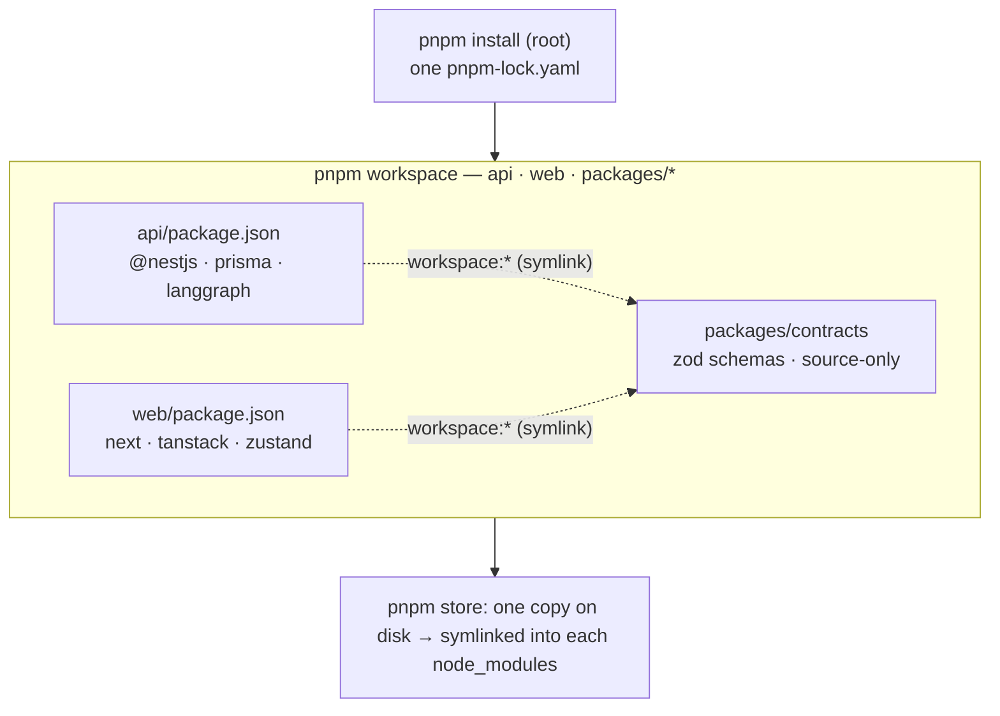

# Working in the monorepo

How dependencies, per-package installs, and the shared `contracts` package work. If you've used a single-package repo before, the one thing to internalize: **this is one repo containing several independent packages, wired together by pnpm workspaces.** You install once at the root; each package keeps its own dependency list.

> See also: [`CLAUDE.md`](../CLAUDE.md) §2 (layout), §7 (config), §8 (contracts), §10–11 (commands & bootstrap), and [`packages/contracts/CLAUDE.md`](../packages/contracts/CLAUDE.md).

---

## The mental model



- The workspace members are declared once in [`pnpm-workspace.yaml`](../pnpm-workspace.yaml): `api`, `web`, `packages/*`.
- **Each member owns its own `package.json`** with its own dependencies. There is no single shared dependency list.
- `pnpm install` (at the root) resolves and links **all** members and writes **one** `pnpm-lock.yaml`.
- pnpm stores each external package once in a global store and **symlinks** it into each member's `node_modules` — no duplicate downloads, and each member only "sees" what it declared.
- Turborepo (`turbo run <task>`) fans a task out across members, runs them in dependency order, and caches results.

---

## Installing dependencies

There are three distinct operations. Note the `--filter` target is the package **name** (the `name` field in its `package.json`), not the folder.

```bash
# 1. Install / relink EVERYTHING for ALL packages. Run once after cloning, and
#    after pulling changes that touch any package.json. Generates pnpm-lock.yaml.
pnpm install

# 2. Add a NEW dependency to ONE package (writes into that package's package.json only):
pnpm --filter @handshake-agent/api add @nestjs/throttler     # backend dep
pnpm --filter @handshake-agent/api add -D @testcontainers/postgresql   # backend dev dep
pnpm --filter @handshake-agent/web add zustand               # frontend dep

# 3. Add a shared devtool at the workspace ROOT (turbo, husky, prettier, …):
pnpm add -Dw turbo                                           # -w = workspace root
```

You do **not** `cd` into each folder and run `install` separately. Everything is driven from the root with `--filter` (by name) or `--filter ./path`.

Run a package's own script the same way:

```bash
pnpm --filter @handshake-agent/api start:dev     # Nest watch mode
pnpm --filter @handshake-agent/web dev           # Next dev server
```

---

## The shared `contracts` package

`packages/contracts` is an **internal library** (never published to npm). It holds the data shapes that must be identical across the frontend, backend, and agent: request/response DTOs, the agent's structured intents, and tool input/output.

These are **Zod schemas**, not just TypeScript types — so one definition does three jobs at runtime:

| Consumer         | Uses the schema for                                                                    |
| ---------------- | -------------------------------------------------------------------------------------- |
| backend (`api`)  | `createZodDto(Schema)` — validates the request body via the global `ZodValidationPipe` |
| frontend (`web`) | `zodResolver(Schema)` for forms + `.parse()` before the axios request fires            |
| agent            | the typed tool / structured-intent shape handed to the model                           |

The matching TypeScript type is derived with `z.infer<typeof Schema>` — define the shape once, get the validator and the type together, and the three consumers can never disagree.

It is **source-only**: its `package.json` `exports` point straight at the `src/*.ts` files — there is no build step and no `dist/`. Editing a schema is picked up immediately by both apps.

### How it gets linked into an app

Add it like any dependency, but with the **`workspace:` protocol**:

```bash
pnpm --filter @handshake-agent/api add '@handshake-agent/contracts@workspace:*'
pnpm --filter @handshake-agent/web add '@handshake-agent/contracts@workspace:*'
```

This writes `"@handshake-agent/contracts": "workspace:*"` into the app's `package.json`. `workspace:*` means _"this is a local member of this repo — symlink it, don't fetch from npm."_ On install, pnpm creates:

```
api/node_modules/@handshake-agent/contracts  →  ../../packages/contracts
web/node_modules/@handshake-agent/contracts  →  ../../packages/contracts
```

So `import { QuoteBuyInputSchema } from '@handshake-agent/contracts'` resolves through the symlink to the real source.

### Per-consumer wiring (already applied)

Because the package ships raw `.ts`, each consumer's toolchain needs one hint to compile it:

| Consumer           | Wiring                                                                                 | Why                                                        |
| ------------------ | -------------------------------------------------------------------------------------- | ---------------------------------------------------------- |
| `web` (Next 16)    | `transpilePackages: ['@handshake-agent/contracts']` in `next.config.ts`                | Next does not transpile a workspace dep's `.ts` by default |
| `api` (`tsc`/Nest) | `paths` alias in `api/tsconfig.json` → `../packages/contracts/src/*`                   | so `tsc` resolves the bare import to source                |
| `api` (Jest)       | `moduleNameMapper` in `api/package.json` → `<rootDir>/../../packages/contracts/src/$1` | ts-jest ignores the package `exports` field                |

### Worked example — add a field once, get it everywhere

Add `memo` to a buy order in `packages/contracts/src/dto/buy-order.dto.ts`:

```ts
memo: z.string().max(140).optional(),
```

Then, with **no rebuild, no version bump, no extra install** (the symlink means everyone reads the same file):

1. `api` — the `createZodDto` DTO already extends that schema, so the endpoint validates `memo` automatically.
2. `web` — the `react-hook-form` form (via `zodResolver`) and the axios `.parse()` accept `memo`, and `z.infer` updates the TS type.
3. agent — the tool/intent shape that imports the schema sees `memo` too.

---

## Conventions & gotchas

- **One `zod` version for our code.** `zod` is pinned `^3.25.32` in `api`, `web`, and `contracts` so the schemas resolve to a single instance (two copies cause silent `instanceof ZodType` failures). Tooling deps that carry a nested `zod@4` are isolated and fine — do **not** add a global `pnpm.overrides` for zod. (See [`CLAUDE.md`](../CLAUDE.md) §6.)
- **Commit `pnpm-lock.yaml`.** CI runs `pnpm install --frozen-lockfile`, which needs the committed lockfile.
- **Use an LTS Node** (`^20.12 || ^22 || >=24`). Node 23 is non-LTS and is rejected by Prisma 7 and `dependency-cruiser`.
- **Build scripts are allowlisted.** pnpm 10 blocks dependency postinstall scripts by default; the approved set lives in the root `package.json` `pnpm.onlyBuiltDependencies`.

## Command cheatsheet

```bash
pnpm install                                   # install/link the whole workspace
pnpm build | lint | typecheck | test           # turbo, all packages
pnpm depcruise                                  # clean-architecture boundary check
pnpm --filter @handshake-agent/api <script>     # run an api package script
pnpm --filter @handshake-agent/web <script>     # run a web package script
pnpm --filter <name> add <dep>                  # add a dep to one package
pnpm add -Dw <devtool>                          # add a shared devtool at the root
```
